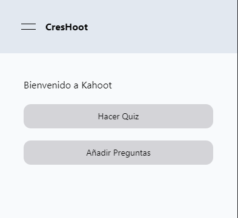
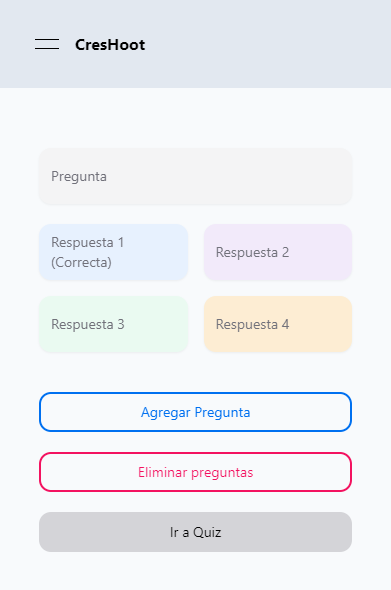
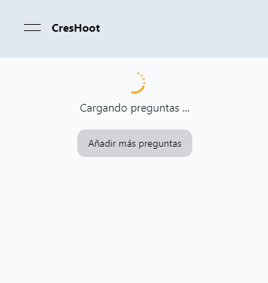
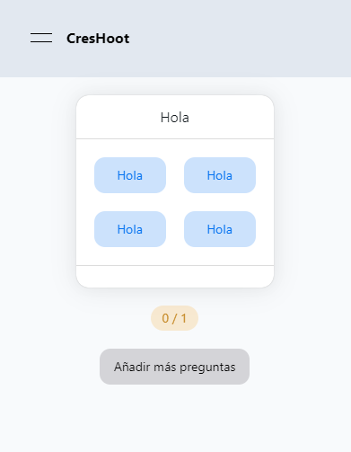
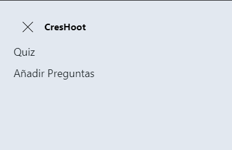

# Kahoot API

## About

Kahoot Clone in Next.js, featuring Tailwind styling and powered by Supabase backend. Create and play real-time interactive quizzes. Enjoy an immersive learning experience with secure authentication. Have fun learning!

## Demo

Demo [aquí](https://kahoot-app.vercel.app/).

## Capturas de pantalla







## Characteristics

- Modern and attractive design.
- Completely responsive and compatible with different devices.
- Easy navigation and intuitive structure.


## Used Technologies

- NextJS: Next.js is a React.js-based development framework that streamlines the creation of modern, high-performance web applications through server-side rendering and static site generation.
- Tailwind CSS: Utility CSS framework for styling the project.
- Supabase: Supabase is an open-source platform that combines the ease of use of a no-code platform with the power of a backend-as-a-service. It provides developers with tools to build applications with databases, authentication, APIs, and real-time updates without needing to manage the underlying infrastructure.

## Instalación

1. Clona este repositorio en tu máquina local.
2. Navega hasta el directorio del proyecto.
3. Ejecuta el siguiente comando para instalar las dependencias:

   ```shell
   npm install 
   ```
4. Una vez finalizada la instalación, ejecuta el siguiente comando para iniciar la aplicación:
     ```shell
   npm run dev
   ```
5. Abre tu navegador y visita el puerto que te de por defecto, en mi caso; http://localhost:3000 para ver el portfolio en tu entorno local.

## Contribución
¡Las contribuciones son bienvenidas! Si encuentras algún error o tienes alguna sugerencia, por favor, abre un issue o envía una pull request.

## Contacto
Si deseas contactarme, puedes enviarme un correo electrónico a alvaro.martin.crespo.00@gmail.com o visitar mi [sitio web](https://alvarodev.vercel.app/) para obtener más información.

